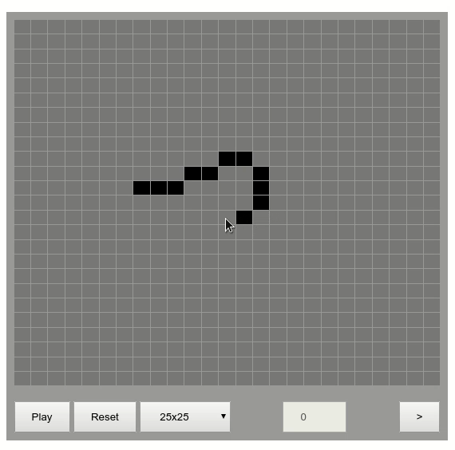

<h1>
  Conway's Game of Life in HTML5   
  
</h1>

## Live Demo
https://alande-amorim.github.io/conways-game-of-life-js/

## This project
This is a tribute to famous british mathematician John Conway that passed away in April 2020 at age of 82. This is my implementation of his famous creation The Game of Life.

## Techs
Just simple stuff, nothing fancy.
- HTML
- CSS
- Javascript

## What is it?
The Game of Life is a cellular automaton by the British mathematician John Conway in 1970. It is a zero-player game, meaning that its evolution is determined by its initial state and very simple rules, requiring no further input. One interacts with the Game of Life by creating an initial configuration and observing how it evolves.

## Rules

- Any live cell with fewer than two live neighbours dies, as if by underpopulation.
- Any live cell with two or three live neighbours lives on to the next generation.
- Any live cell with more than three live neighbours dies, as if by overpopulation.
- Any dead cell with exactly three live neighbours becomes a live cell, as if by reproduction.

## How to play
- Click on the tiles of the board to draw any pattern you want.
- Click 'Play' and watch what happens.
- Watch. Can you preddict what will happen next?

## Patterns
Many different patterns can be observed in the Game of Life which are classified according to their behavior. 
They are categorized into: still (does not change over generations), oscillators (oscillates between two or more states) or spaceships (oscilates shape while moving around).
<table>
  <tr>
    <td>
      <table>
        <tr>
          <th colspan="2">Still lifes</th>
        </tr>
        <tr>
          <td>Block</td>
          <td></td>
        </tr>
        <tr>
          <td>Bee-hive</td>
          <td></td>
        </tr>
        <tr>
          <td>Loaf</td>
          <td></td>
        </tr>
        <tr>
          <td>Boat</td>
          <td></td>
        </tr>
        <tr>
          <td>Tub</td>
          <td></td>
        </tr>
      </table>
      

      

    </td>
    <td>
      <table>
        <tr>
          <th colspan="2">Oscillators
          </th>
        </tr>
        <tr>
          <td>Blinker (period 2)</td>
          <td></td>
        </tr>
        <tr>
          <td>Toad (period 2)</td>
          <td></td>
        </tr>
        <tr>
          <td>Beacon (period 2)</td>
          <td></td>
        </tr>
        <tr>
          <td>Pulsar (period 3)</td>
          <td></td>
        </tr>
        <tr>
          <td>Penta- decathlon (period&nbsp;15)</td>
          <td></td>
        </tr>
      </table>
    </td>
    <td>
      <table>
        <tr>
          <th colspan="2">Spaceships</th>
        </tr>
        <tr>
          <td>Glider</td>
          <td></td>
        </tr>
        <tr>
          <td>Light- weight spaceship (LWSS)</td>
          <td></td>
        </tr>
        <tr>
          <td>Middle- weight spaceship (MWSS)</td>
          <td></td>
        </tr>
        <tr>
          <td>Heavy- weight spaceship (HWSS)</td>
          <td></td>
        </tr>
      </table>
    </td>
  </tr>
</table>

source: [wikipedia](https://en.wikipedia.org/wiki/Conway%27s_Game_of_Life#Examples_of_patterns)